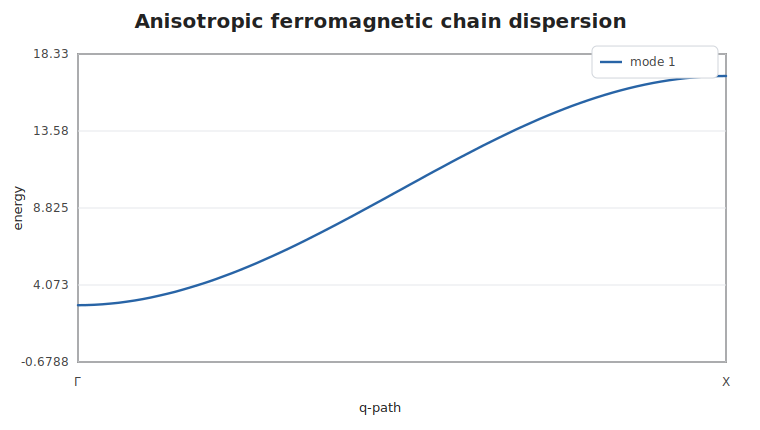
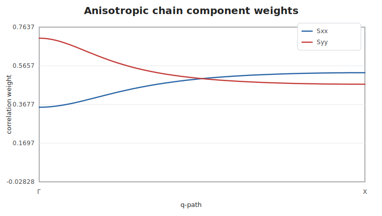

# Anisotropic Ferromagnetic Chain

This example replaces the isotropic nearest-neighbor matrix with a diagonal
anisotropic exchange matrix. The ordered moment is along `z`, so the transverse
components carry different weights.

```@example anisochain
using SpinWave

model = SpinModel(lattice([1, 1, 1]))
addsite!(model, :A, [0, 0, 0]; spin=1, moment=[0, 0, 1])
addmatrix!(
    model,
    :Jdiag,
    exchange_matrix([
        -3.0 0.0 0.0
        0.0 -4.0 0.0
        0.0 0.0 -5.0
    ]),
)
addbond!(model, :Jdiag, :A, :A, [1, 0, 0])

path = qpath([[0, 0, 0], [0.5, 0, 0]]; points=81, labels=["Γ", "X"])
spec = spinwave(model, path)

samples = [1, 21, 41, 61, 81]
round.(spec.energies[:, samples]; digits=4)
```



The raw correlation tensor keeps component information before any plotting or
grid broadening step. Here the transverse `Sxx` and `Syy` weights differ because
the exchange matrix is anisotropic:

```@example anisochain
sx = real.(spec.correlations[1, 1, 1, :])
sy = real.(spec.correlations[2, 2, 1, :])
round.(hcat(sx[samples], sy[samples]); digits=4)
```


