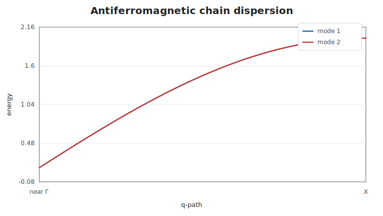

# Antiferromagnetic Chain

This example uses a two-site unit cell with opposite ordered moments and
positive nearest-neighbor exchange. The scan starts just away from the exact
zero-mode endpoint so the current dense solver can sort the degenerate modes
unambiguously.

```@example afchain
using SpinWave

model = SpinModel(lattice([1, 1, 1]))
addsite!(model, :A, [0, 0, 0]; spin=1, moment=[0, 0, 1])
addsite!(model, :B, [0.5, 0, 0]; spin=1, moment=[0, 0, -1])
addmatrix!(model, :J, heisenberg(1.0))
addbond!(model, :J, :A, :B, [0, 0, 0])
addbond!(model, :J, :B, :A, [1, 0, 0])

path = qpath([[0.02, 0, 0], [0.5, 0, 0]]; points=81, labels=["near Γ", "X"])
spec = spinwave(model, path)

samples = [1, 21, 41, 61, 81]
round.(spec.energies[:, samples]; digits=4)
```



The two branches are degenerate for this simple collinear model. A broadened
grid can be generated the same way as for the ferromagnetic chain:

```@example afchain
grid = broaden(spec, range(0, 2.2; length=31); eta=0.12)
size(grid.intensity), round(maximum(grid.intensity); digits=4)
```
