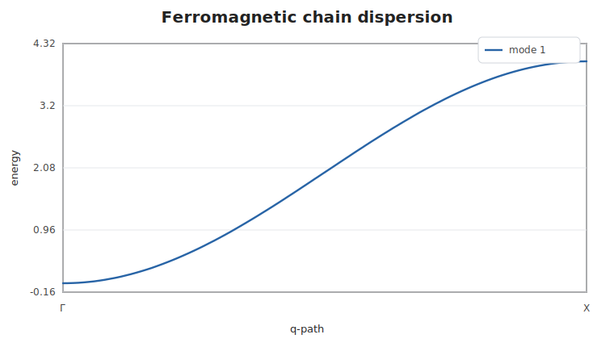
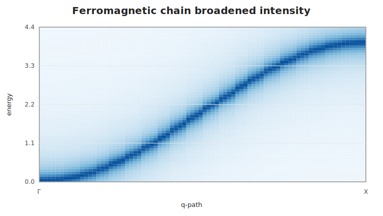

# Ferromagnetic Chain

This example computes the one-site nearest-neighbor ferromagnetic chain. The
runnable script in `examples/ferromagnetic_chain.jl` uses the same code and can
also emit the SVG plots shown below.

```@example chain
using SpinWave

model = SpinModel(lattice([1, 1, 1]))
addsite!(model, :A, [0, 0, 0]; spin=1, moment=[0, 0, 1])
addmatrix!(model, :J, heisenberg(-1.0))
addbond!(model, :J, :A, :A, [1, 0, 0])

path = qpath([[0, 0, 0], [0.5, 0, 0]]; points=101, labels=["Γ", "X"])
spec = spinwave(model, path)

samples = [1, 26, 51, 76, 101]
round.(spec.energies[:, samples]; digits=4)
```



The zero at `Γ` is the ferromagnetic Goldstone mode. A lightweight Lorentzian
energy grid can be produced without adding a plotting dependency:

```@example chain
grid = broaden(spec, range(0, 4.4; length=120); eta=0.12)
size(grid.intensity), round(maximum(grid.intensity); digits=4)
```


