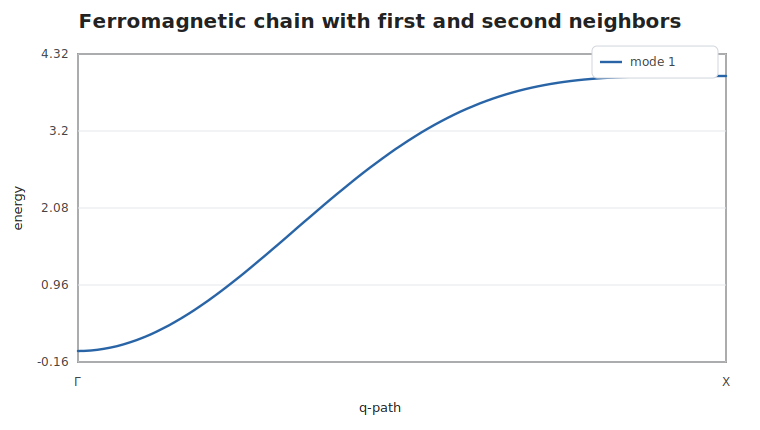

# Next-Nearest-Neighbor Chain

This example adds a second ferromagnetic bond shell to the one-site chain. It is
useful as a compact check that multiple directed bonds with different labels
contribute to the same spectrum.

```@example nnnchain
using SpinWave

model = SpinModel(lattice([1, 1, 1]))
addsite!(model, :A, [0, 0, 0]; spin=1, moment=[0, 0, 1])
addmatrix!(model, :J1, heisenberg(-1.0))
addmatrix!(model, :J2, heisenberg(-0.25))
addbond!(model, :J1, :A, :A, [1, 0, 0])
addbond!(model, :J2, :A, :A, [2, 0, 0])

path = qpath([[0, 0, 0], [0.5, 0, 0]]; points=101, labels=["Γ", "X"])
spec = spinwave(model, path)

samples = [1, 26, 51, 76, 101]
round.(spec.energies[:, samples]; digits=4)
```

The second-neighbor term stiffens the middle of the band while preserving the
ferromagnetic zero mode at `Γ`.


