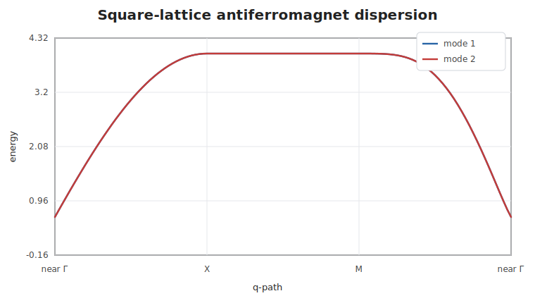
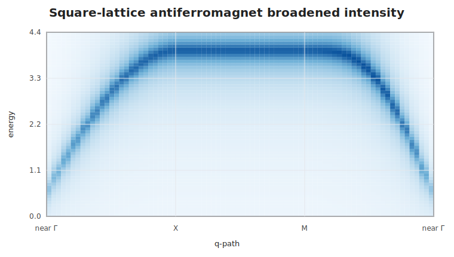

# Square-Lattice Antiferromagnet

This example builds a checkerboard antiferromagnet manually by listing the four
nearest-neighbor bonds from one sublattice to the other. The scan follows
near-Γ, `X`, `M`, and back toward near-Γ.

```@example squareaf
using SpinWave

model = SpinModel(lattice([1, 1, 1]))
addsite!(model, :A, [0, 0, 0]; spin=1, moment=[0, 0, 1])
addsite!(model, :B, [0.5, 0.5, 0]; spin=1, moment=[0, 0, -1])
addmatrix!(model, :J, heisenberg(1.0))

addbond!(model, :J, :A, :B, [0, 0, 0])
addbond!(model, :J, :A, :B, [-1, 0, 0])
addbond!(model, :J, :A, :B, [0, -1, 0])
addbond!(model, :J, :A, :B, [-1, -1, 0])

path = qpath(
    [[0.05, 0, 0], [0.5, 0, 0], [0.5, 0.5, 0], [0.05, 0, 0]];
    points=[41, 41, 41],
    labels=["near Γ", "X", "M", "near Γ"],
)
spec = spinwave(model, path)

path.ticks, round.(spec.energies[:, path.ticks]; digits=4)
```



The degenerate branches reach the maximum energy at the zone-edge segment:

```@example squareaf
maximum(spec.energies)
```

The same spectrum can be broadened onto an energy grid for a compact intensity
view:

```@example squareaf
grid = broaden(spec, range(0, 4.4; length=120); eta=0.16)
size(grid.intensity)
```


